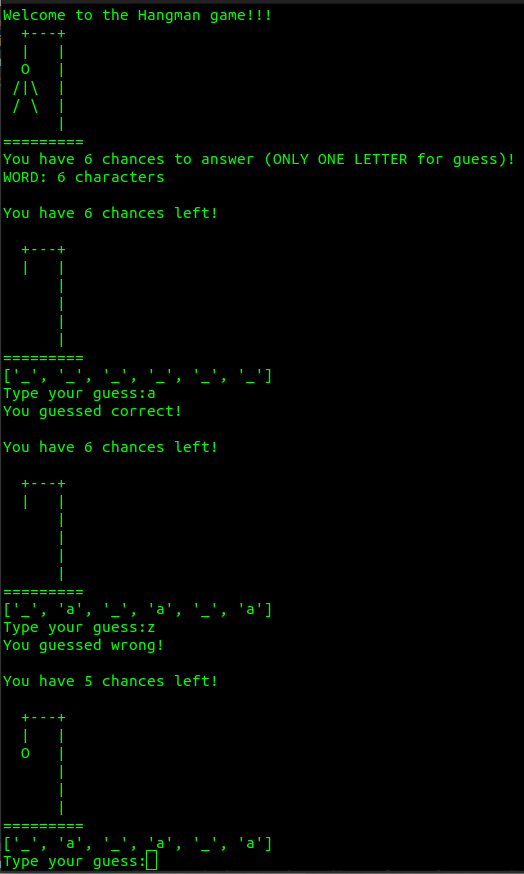

<h1>PYTHON Hangman game - Jogo da Forca</h1>

EN-US

With this game I could exercise: list comprehension, loops, flags, strings, builtin modules, builtin methods, conditional statementes and file handling.

Selected words come from a .txt file with portuguese words from 5 to 10 letters;

PT-BR

Com esse projeto pude exercitar conceitos de Python como: list comprehension, loops, flags, strings, builtin modules, builtin methods, conditional statementes e manipulaçao de arquivos.

As palavras selecionadas vem de um arquivo .txt com palavras em português de 5 a 10 letras.

<h2>Interface</h2>
